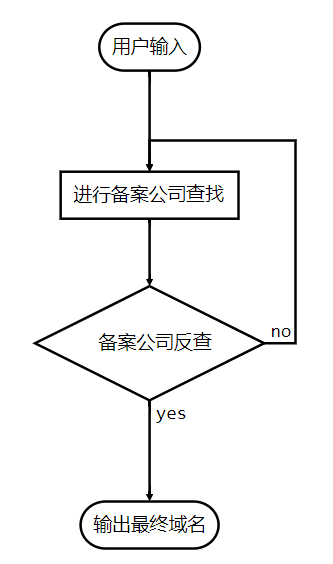

# Get_ICP_Url自动化的域名备反查

```
  _____ _____ _____     _____                     _     
 |_   _/ ____|  __ \   / ____|                   | |    
   | || |    | |__) | | (___   ___  __ _ _ __ ___| |__  
   | || |    |  ___/   \___ \ / _ \/ _` | '__/ __| '_ \ 
  _| || |____| |       ____) |  __/ (_| | | | (__| | | |
 |_____\_____|_|      |_____/ \___|\__,_|_|  \___|_| |_|
 
 
  输入域名自动查询备案公司旗下的所有，方便快捷
  
  使用的是站长之家的查询接口
```

# 使用方法


环境需要Python3和 're,request,sys' 这三个库


直接进入Dos命令行`python3 get_icp_url.py xxx.com`,结果会以终端输出和保存到文件

# 执行步骤

